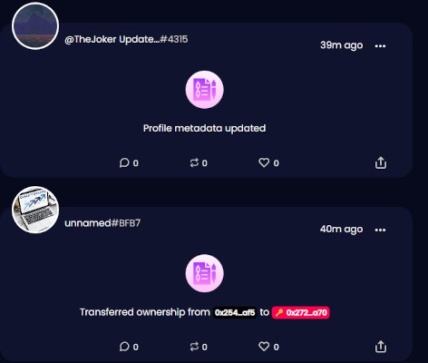
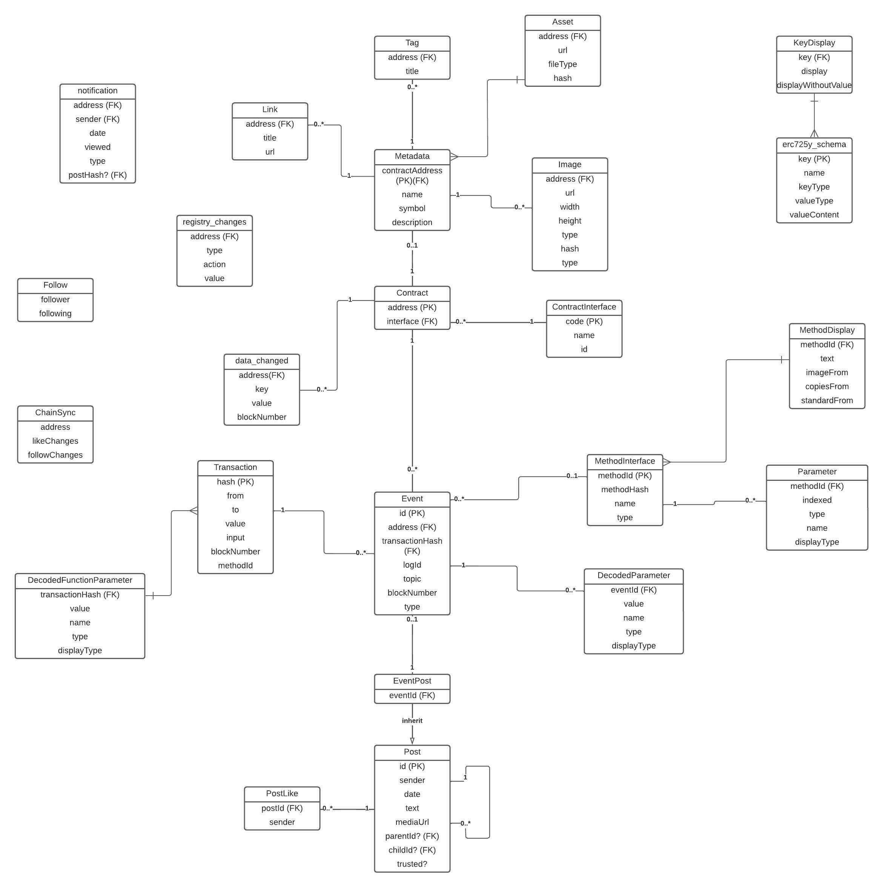

# Collaborators & Social Media

* Samuel Videau <samuel@dropps.io>
* António Pedro Silva <antonio@dropps.io>
* Carlos Caldas <carlos@dropps.io>

* https://dropps.io
* https://twitter.com/dropps_io
* https://discord.gg/nzn3BGHyYH

Ethereum address: 0x053C7c6bC6d4A47DAD5A2DE8AF6d2aA870B95168

# What is [LOOKSO](https://lookso.io) 


LOOKSO is a Universal Profile based social media feed where users post messages and interact. It combines user-generated content with a digest of relevant events emmited by Universal Profile contracts in the blockchain. This feed is a valuable addition to block explorers and allows the users to not only follow their favorite NFT collections, artists or investors, but also to comment on what they are doing on the blockchain.

As long as you have a Universal Profile, you have an account in LOOKSO. Other profiles might follow yours and will get notified about transactions you made that generated logs on the blockchain. You only ever need to authenticate when you want to write customized messages or interact with content generated by other Profiles. 

# Other repositories

* [Back-end (private)](https://github.com/dropps-io/dropps-back/tree/lukso-hackathon)
* [Front-end (private)](https://github.com/dropps-io/lookso/tree/lukso-hackathon)


# Quick Reference

* [Website](https://lookso.io)
* [LIP-social_media_feed](https://github.com/dropps-io/dropps-submission-build-up/blob/main/LIPs/lip-social_media_feed.md)
* [LIP-validator](https://github.com/dropps-io/dropps-submission-build-up/blob/main/LIPs/lip-validator.md)
* [Youtube Video](https://youtu.be/lNljYm68qHI)

# Architecure

## Overview

LOOKSO leverages decentralized storage to minimize gas costs and allow media content like images and videos to be attached to messages. Every message, like and follow is saved in the Arweave blockchain and a single record file is kept updated for each Universal Profile (UP). This social media record file is nothing more than a JSON object and is saved on the Universal Profile's (UP) storage.

The [record](#Social Media Record File) is the only thing saved on the user's UP and contains a list of created posts, liked posts and followed UPs, which all together composes a user's social media state. 


There is a third actor whose role is to provide a reliable method to authenticate messages authors, just like a signature would do for EOAs, and to validate the timestamp for the messages in the network. It is a [validator](#validator) smart contract on the LUKSO blockchain and can be called to append the msg.sender and the current block timestamp to the message hash and save it in its own [ERC725Y](https://github.com/ethereum/EIPs/blob/master/EIPS/eip-725.md#erc725y) storage for future validation.

All the data is indexed in a local database and served as an API to speed up and simplify the queries necessary to provide a consistent and fast user experience. 


## Blockchain


### The Validator Contract

```solidity
// SPDX-License-Identifier: MIT

pragma solidity ^0.8.7;

import { Context } from "@openzeppelin/contracts/utils/Context.sol";
import { ERC725YCore } from "@erc725/smart-contracts/contracts/ERC725YCore.sol";
import { OwnableUnset } from "@erc725/smart-contracts/contracts/custom/OwnableUnset.sol";
import { GasLib } from "@erc725/smart-contracts/contracts/utils/GasLib.sol";

contract Validator is ERC725YCore(), Context {

    constructor() {
        OwnableUnset._setOwner(address(0)); // No owner needed
    }

    function validate(bytes32 contentHash) external {
        require( getData(contentHash).length == 0, 
            "Corresponding value for this hash is not null. Content has been added under this hash before.");
        // Write to the Key-Value Storage.
        setData(contentHash, bytes(abi.encodePacked(address(_msgSender()), bytes12(uint96(block.timestamp)))));
    }

    function setData(bytes32 dataKey, bytes memory dataValue) public virtual override {
        _setData(dataKey, dataValue);
    }

    function setData(bytes32[] memory dataKeys, bytes[] memory dataValues)
        public
        virtual
        override
    {
        require(dataKeys.length == dataValues.length, "Keys length not equal to values length");
        for (uint256 i = 0; i < dataKeys.length; i = GasLib.uncheckedIncrement(i)) {
            _setData(dataKeys[i], dataValues[i]);
        }
    }

    function getTimestamp(bytes32 key) public view returns(bytes12) {
        return bytes12(bytes32(this.getData(key)) << 160);
    }

    function getAddress(bytes32 key) public view returns (bytes20) {
        return bytes20(this.getData(key));
    }
}
```

This is a generic contract that provides a validating service for any kind of message. Because this contract cannot prove authenticity by signing a message, the validator saves the message hash in its own storage, alongside the timestamp and the original sender. Anyone can use this registry to store their claims and attest authenticity their creation date. For more information, check [LIP-VALIDATOR](https://github.com/dropps-io/dropps-submission-build-up/blob/main/LIPs/lip-validator.md).

For the LOOKSO project, we extended the validating service with the capability to write to the LSPXXSocialRegistry key on the Universal Profile. This was done for the convenience of bundling two tasks in a single transaction and avoiding extra costs for the user. The message hash is sent for validation alongside the social record that includes it. The message hash is stored and the social record URL written on the Universal Profile. 

```solidity
// SPDX-License-Identifier: MIT

pragma solidity ^0.8.7;

import { ERC725Y } from "@erc725/smart-contracts/contracts/ERC725Y.sol";
import {_INTERFACEID_ERC725Y} from "@erc725/smart-contracts/contracts/constants.sol";
import { OwnableUnset } from "@erc725/smart-contracts/contracts/custom/OwnableUnset.sol";
import { ERC165Checker } from "@openzeppelin/contracts/utils/introspection/ERC165Checker.sol";
import { ILSP6KeyManager} from "@lukso/lsp-smart-contracts/contracts/LSP6KeyManager/ILSP6KeyManager.sol";
import { Validator } from "./Validator.sol";

contract LooksoPostValidator is Validator {

    bytes32 public constant REGISTRY_KEY = keccak256("LSPXXSocialRegistry");
  
    constructor() Validator() {}

    function post(bytes32 postHash, bytes calldata jsonUrl) public {
        this.validate(postHash);
        //Update the registry in the UP
        require(ERC165Checker.supportsERC165(_msgSender()), "Sender must implement ERC165. A UP does.");
        require(ERC165Checker.supportsInterface(_msgSender(), _INTERFACEID_ERC725Y), "Sender must implement IERC725Y (key/value store). A UP does");

        bytes memory encodedCall = abi.encodeWithSelector(
            bytes4(keccak256(bytes("setData(bytes32,bytes)"))),
            REGISTRY_KEY, jsonUrl
        );

        ILSP6KeyManager( OwnableUnset(_msgSender()).owner() ).execute(encodedCall); // Execute through the Key Manager
    }
}
```

For more details on the format of the Social Media Record being pointed by the JSON Url, please refer to [LIP-social_media_feed](https://github.com/dropps-nft/Lookso/blob/main/LIPs/lip-social_media_feed.md).


## Event scraping and translation



One of the key features of the LOOKSO platform is that it scrapes blockchain events related to Universal Profiles and displays them in a user friendly way. This is a game changer when it comes to visualizing what's happening on the network and interacting with it. 

You can comment, repost and like an event, just like you can with any other user-generated content. This feed will be hotter than ever 🔥!
Events and their indexed parameters are saved on the backend database, alongside their translation and the Universal Profile that emitted them. 


## Decentralized Storage </img>

We chose Arweave because it's cheap, easy to use and provides the degree of decentralization and interoperability we are looking for. Arweave offers a GraphQL endpoint to query for transaction metadata, which is very useful to find all the content associated with a given protocol or app. Each transaction offers 2kb of queryable space in the form of key-value pairs (tags). Any application wanting to plug itself into the Social Media Network can simply query Arweave and look for the protocol tag in the transactions. Alternatively, a dApp can fetch the Social Media Record File from a Universal Profile, and from there display all the related content stored on Arweave.

## The Backend

A server created with the Fastify framework for Node serves a postgreSQL database, which indexes all of the data used in the frontend. Here is the table schema:



Notice that this schema reflects the filosophy of the standard we propose with LOOKSO. All messages are posts:

* Comments are posts with a parentHash value.
* Reposts are posts with a childHash value.
* Posts have no parentHash or childHash.

Event decoding and translation is also a big part of LOOKSO's backend work. After the event and all of its parameters are understood by the platform, a new post is created to include this event and display it side by side with the user's messages. 

## Data format

### Social Media Record File

This record is saved under the (provisory) Key name of "LSPXXSocialRegistry". Here is the schema according to [LSP2](https://github.com/lukso-network/LIPs/blob/main/LSPs/LSP-2-ERC725YJSONSchema.md):

```JSON
{
    "name": "LSPXXSocialRegistry",
    "key": "0x661d289e41fcd282d8f4b9c0af12c8506d995e5e9e685415517ab5bc8b908247",
    "keyType":"Singleton",
    "valueType": "bytes",
    "valueContent": "JSONURL",

}
```

And here is an example of the record file after decoding and fetching the JSONURL:

```JSON
{
  "LSPXXSocialRegister": {
    "profile_posts": [
      {
        "url": "ipfs://bafkreicwro4hgt42c256ggdnsd5ovrw6g62barfhsfd2umxdye764hlar4",
        "hash": "0x64810d3e12ade0816a03fb96d8a763f2cb4f6f00afbe5b5f5e81179892e7f00f"
      }
    ],
    "following": [
      "0xA5284665954a54d12737Da405824160cCE05B0B0",
      "0xB1a2B3518c30Eb82bb18Fe75456e83B692A75FFa"
    ],
    "likes": [
      "0xb65a4ddc17641434ef1a3db047b7d52a08e4c22a994ab6ffe580d7a786ca9d78",
      "0x0017eb3f3b2c10c3387c710e849c64527ae331bfb2d42fb70fbe95588ff5d6cd",
      "0x64810d3e12ade0816a03fb96d8a763f2cb4f6f00afbe5b5f5e81179892e7f00f",
    ]
  }
}
```

## The Post Object

```JSON
{
  "LSPXXProfilePost": {
    "version":"0.0.1",
    "message": "This is the first Lookso post.",
    "author": "0x742242E9572cEa7d3094352472d8463B0a488b80",
    "validator": "0x049bAfA4bF69bCf6FcB7246409bc92a43f0a7264",
    "nonce": "415665014",
    "links": [
      {
        "title": "Our website",
        "url": "https://dropps.io"
      }
    ],
    "asset": {
      "hashFunction": "keccak256(bytes)",
      "hash": "0x813a0027c9201ccdec5324aa32ddf0e8b9400479662b6f243500a42f2f85d2eb",
      "url": "ar://gkmVUoHE4Ay6ScIlgV4E7Fs1m13LfpAXSuwuRGRQbeA",
      "fileType": "jpg"
    },
    "parentHash":"0xdc1812e317c6cf84760d59bda99517de5b5c5190fcf820713075430337805340",
    "childHash":""
  },
  "LSPXXProfilePostHash": "0x0017eb3f3b2c10c3387c710e849c64527ae331bfb2d42fb70fbe95588ff5d6cd",
  "LSPXXProfilePostSignature": "0x2845551019619d59657b6e485d1cb2067479a5bc364270030d7c4143b4cc0ee5279432bee8425f17d091f067e6b8f987390900b1fd82bef52fcb4c8b2b06ab901b"
}
```

This is an example of a post object. You can find more details about it in the [LIP-social_media_feed](https://github.com/dropps-nft/Lookso/blob/main/LIPs/lip-social_media_feed.md)


# Future improvements

* Refactor following system so that universalReceiver can be called and a UP can decide what to do when it is being followed. Implement following like an nft transfer.
* Add a relay service and improve the post flow. The user should sign the transaction to update the social record in his profile, but it should never go through unless the upload to decentralized storage is successful. On the other hand, we should not upload to decentralized storage first and then give the user the option to cancel the transaction. A relay service helps to manage this situation by postponing the signed transaction until the upload to decentralized storage is complete.
* Improve event translation (for ex. Profile metadata updated can display the before and after values)
* Narrow the permissions given to the validator contract for a specific key (LSPXXSocialRegistry).
* Create a system that allows developers to submit translations to events in smart contracts created by them. This makes LOOKSO more complete and gives developers a chance to make their work stand out.

